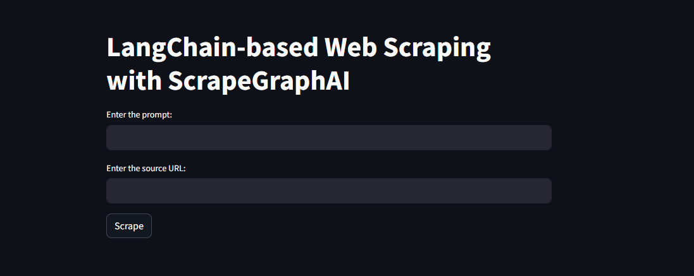

# LLM-based Web Scraping using ScrapeGraphAI

Author: Md Mutasim Billah Abu Noman Akanda, Machine Learning Engineer  
Date: 12 June 2024

## Project Description

This project demonstrates how to perform Langchain-based web scraping using ScrapeGraphAI, integrating FastAPI for backend processing, and Streamlit for the frontend interface. The scraped results are saved in a structured format, and all logs are maintained for debugging and tracking purposes. Key features include:

- User input validation to ensure the prompt and URL are correctly provided.
- A progress bar that displays the scraping progress until the operation is complete.
- Robust error handling mechanisms to manage and report various errors effectively.

## Folder Structure

```
langchain-based-web-scraping-with-scrapegraphai
├── app.py
├── main.py
├── scrap.py
├── logs/
│ ├── app.log
│ ├── main.log
│ └── scrap.log
├── results/
│ └── <scraped_results>.json
├── README.md
└── requirements.txt
```


## Cloning the Repository

To clone this repository, run the following command in your terminal or command prompt:

```sh
git clone https://github.com/noman024/Langchain-based-Web-Scraping-with-ScrapeGraphAI.git
cd Langchain-based-Web-Scraping-with-ScrapeGraphAI
```

## Setup
- Python 3.9.16
- ScrapeGraphAI
- langChain
- WebKit
- Ollama
- Playwright, and so on.

For all the dependencies, please refer to `requirements.txt` and you won't need to install required dependencies manually. I have already do the automation in `install.sh` for linux and macos user and in `install.bat` for windows user.

## Automated Installation

To automate the environment setup and installation of requirements, follow these steps:

### For Unix-like systems (Linux, macOS)

```sh
sh install.sh
conda activate scrap-noman
```

### For Windows

- No need to create virtual environment
- Download ollama.exe manually from https://ollama.com/download/windows and then back to the terminal again:
```
install.bat
```

### Install Requirements

```
pip install -r requirements.txt
```

## Usage

### Running the Backend Server

The backend is built using FastAPI. To start the server, run:

```
uvicorn main:app --reload
```

### Running the Frontend Interface

The frontend is built using Streamlit. To start the Streamlit app, run:

```
streamlit run app.py
```

### Interface

After running both the FastAPI backend and Streamlit frontend, you need to go to [http://localhost:8501/](http://localhost:8501/) and see a user interface like below:



### Log Files

All logs are stored in the `logs` directory:

- `scrap.log`: Logs for the scraping script.
- `app.log`: Logs for the Streamlit app.
- `main.log`: Logs for the FastAPI server.

### Results
Scraped results are stored in the `results` directory, with filenames generated based on the URL and prompt. The filenames structure is `shortenedScrapedURL_Prompt_YYYYMMDD_hhmmss` where:

- `Y` stands for `Year`
- `M` stands for `Month`
- `D` stands for `Date`
- `h` stands for `hour`
- `m` stands for `minutes`
- `s` stands for `seconds`

## API Endpoints

`/scrape/`

_Method_: Post

_Request Body_: 
```
{
  "prompt": "your prompt",
  "source": "http://example.com"
}
```

_Response_: 200 OK/Succees

```
{
  "result": {
    ...scraped_data...
  }
}
```

## Configuration

You can configure the scraper and other settings by modifying the corresponding sections in the scripts.

### Example Configuration in `scrap.py`

```
graph_config = {
    "llm": {
        "model": "ollama/mistral",
        "temperature": 1,
        "format": "json",
        "model_tokens": 2000,
        "base_url": "http://127.0.0.1:11434",
    },
    "embeddings": {
        "model": "ollama/nomic-embed-text",
        "temperature": 0,
        "base_url": "http://127.0.0.1:11434",
    }
}

```
 
## Example Input/Output

### Input

_Prompt_: List me the product name and price

_URL_: https://www.daraz.com.bd/mens-wallets/

### Output

```
{
    "ProductInformation": [
        {
            "Name": "Leather Wallet for Men-Black ( CARTELO)",
            "Price": 75
        },
        {
            "Name": "Multi Slot Card Holder Vintage Small Wallet Women Men Business Bank Credit Card Bag Male Coin Pouch Solid Leather Zipper Wallet",
            "Price": 153
        },
        {
            "Name": "Best quality Stylish Zipper Leather wallet For Men",
            "Price": 169
        },
        {
            "Name": "Fashionable Wallet For Men - Wallet",
            "Price": 80
        },
        {
            "Name": "Wallet Men Wallets Fashion Long Wallet PU Leather Long Wallet Business Wallets Men's Anti-theft Soft Wallet Splicing Two Fold Ultra-thin Long Wallet Travel Purses Coin Pouch ID Credit Cards Holders",
            "Price": 178
        },
        {
            "Name": "Mobile Cover and Card Holder Long Wallet - Black",
            "Price": 69
        },
        {
            "Name": "Black Leather Vipar Long Lusting Long Wallet For Men - Wallet - Wallet",
            "Price": 133
        },
        {
            "Name": "Artificial Lether Wallet for Men",
            "Price": 88
        },
        {
            "Name": "Canvas Men Wallet Black/blue/gray Card Holder Wallet Male Money Bag ID/photo/bank Holder Short Purse Credit Card Case Bag",
            "Price": 320
        },
        {
            "Name": "Jeep Black 100% Leather wallet For Man - Wallet For Men - Many Beg",
            "Price": 359
        },
        {
            "Name": "Round Zipper Stylish High quality Artificial Leather wallet For Men - Wallet - Wallet For Men",
            "Price": 178
        }
    ]
} 
```

## Feel Free to Contribute

Feel free to contribute to this project by forking it and creating pull requests for any improvements or fixes. If you encounter any issues or have suggestions, please raise them in the Issues section of the repository. Your contributions and feedback are greatly appreciated!